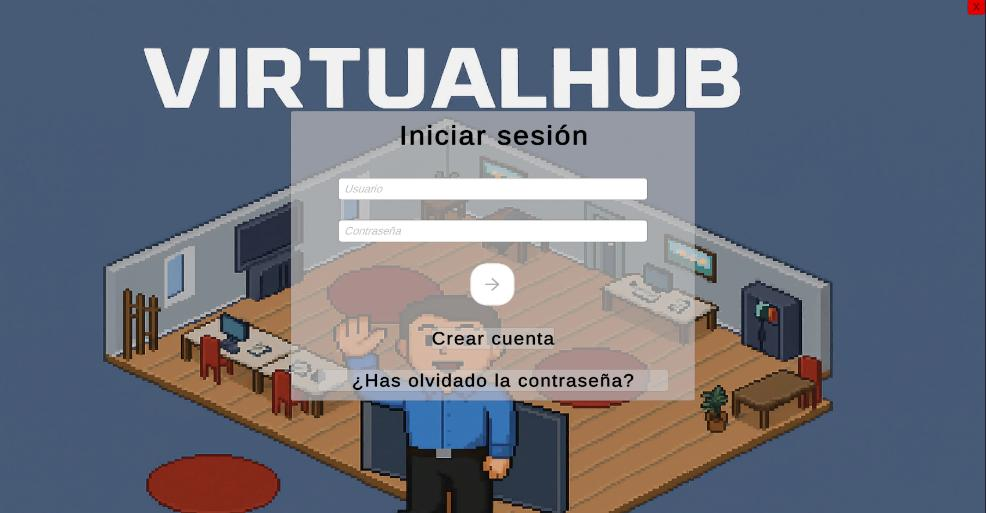
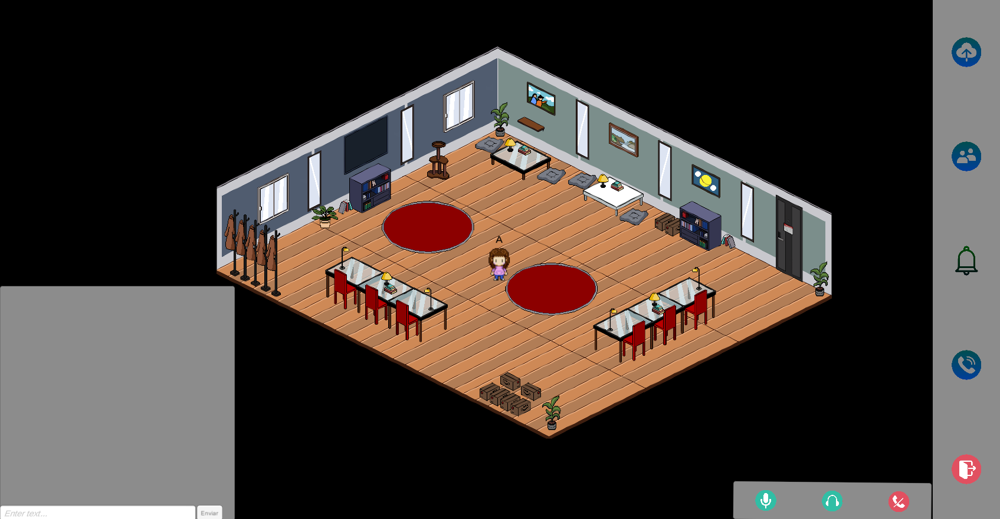
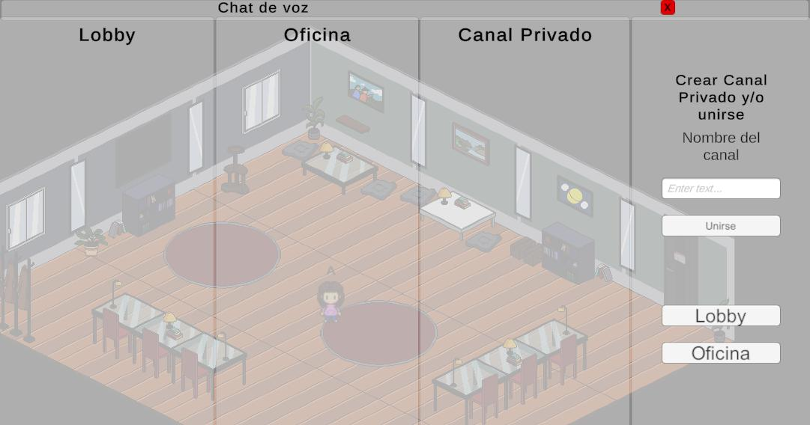
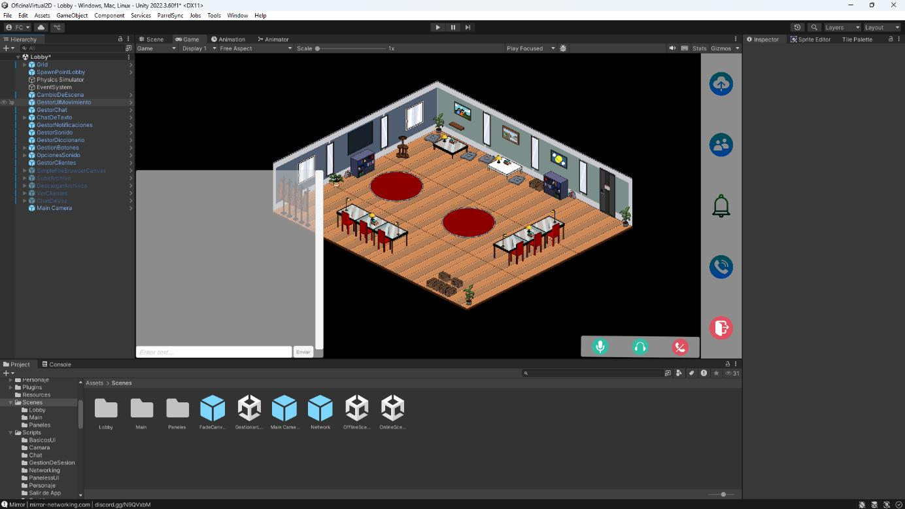
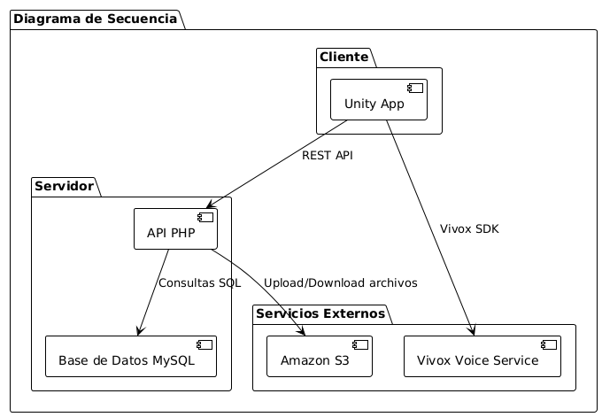
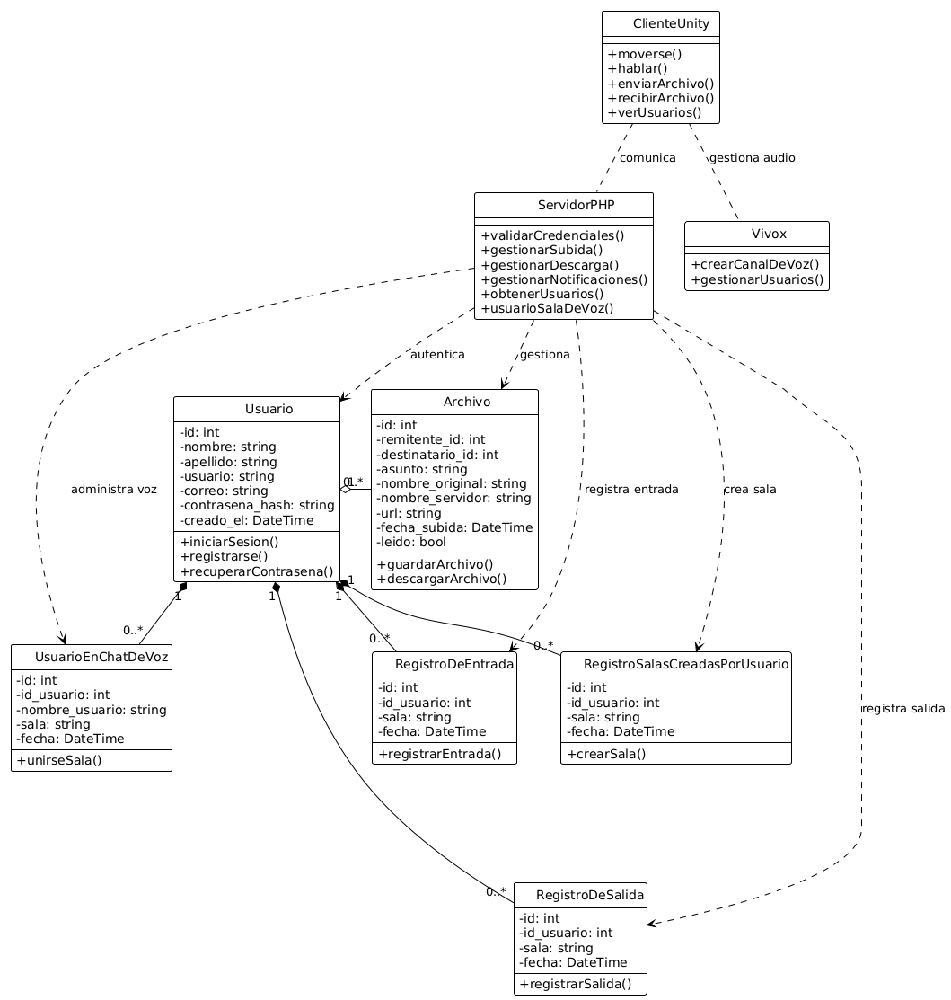

# 🏢 Oficina Virtual 2D

Oficina virtual colaborativa en 2D: cada usuario controla un personaje, se mueve por la oficina, habla por voz con quien tenga cerca y envía/recibe archivos de forma segura con el resto del equipo. Proyecto final del Grado Superior en Desarrollo de Aplicaciones Multiplataforma.

El objetivo fue aplicar en un caso real arquitectura cliente-servidor, redes en tiempo real y seguridad (autenticación, cifrado, control de accesos) con un stack completo: motor de juego, backend propio y servicios en la nube.

## 🖼️ Capturas

| Login | Oficina (gameplay) |
|---|---|
|  |  |

| Salas de chat de voz | Vista en el editor de Unity |
|---|---|
|  |  |

## ⚠️ Estado del proyecto

Este proyecto estuvo desplegado en un servidor propio (AWS EC2 + RDS + S3 + Vivox) durante su desarrollo. Ese servidor ya no está activo, por lo que este repositorio contiene el **código fuente documentado** (PHP del backend, scripts C# de Unity, esquema de base de datos) en lugar del proyecto Unity completo (~650 MB con librerías y caché de Unity, no apto para control de versiones sin LFS).

Todas las credenciales reales (contraseña de base de datos, host de RDS, token compartido API) han sido **sustituidas por variables de entorno** antes de subir el código — ver `php/config.example.php`.

## 🧱 Arquitectura



```
Cliente (Unity 2D)
   │
   ├── Mirror ──────────► Sincronización de posición y estado entre jugadores
   │
   ├── REST API (PHP) ──► Autenticación, notificaciones, gestión de archivos
   │                            │
   │                            ▼
   │                        MySQL (usuarios, archivos, salas de voz)
   │
   ├── AWS S3 ───────────► Almacenamiento de archivos (subida/descarga)
   │
   └── Vivox SDK ────────► Chat de voz (salas privadas / canales)
```

## 📂 Estructura del repositorio

```
oficina-virtual-2d/
├── unity-scripts/      → Scripts C# del cliente (organizados por sistema)
│   ├── GestionDeSesion/    Login, registro, cambio/recuperación de contraseña
│   ├── Networking/         Gestión de conexión/desconexión con Mirror
│   ├── Sonido/              Integración con Vivox (chat de voz)
│   ├── PanelessUI/          Notificaciones, subida/descarga de archivos
│   ├── Personaje/           Movimiento del personaje
│   └── Camara/, Chat/, CompartirPantalla/, ...
├── php/                 → API REST del backend
│   ├── login.php, registrarse.php, changePassword.php, recoverAccount.php
│   ├── uploader.php, downloadDocs.php        (integración con AWS S3)
│   ├── entradaSalidaChatDeVoz.php, obtenerUsuariosEnSala.php
│   ├── getNotification.php, updateNotification.php, uploadNotification.php
│   └── config.example.php                    (plantilla de configuración)
├── database/
│   └── Tablas.sql       → Esquema completo de la base de datos MySQL
├── binaries/
│   └── DesktopCaptureDLL.dll  → DLL nativa para la función de compartir pantalla
├── art-assets/          → Sprites e iconos usados en el cliente
└── docs/
    ├── Memoria.pdf, Resumen Ejecutivo.pdf
    ├── Presentacion_PFC.pptx
    └── Diagramas/        (UML de clases, secuencia, actividades, Gantt)
```

## 🛠️ Tecnologías

| Categoría | Tecnologías |
|---|---|
| Cliente / Juego | Unity 2D, C#, Mirror |
| Backend | PHP, MySQL |
| Cloud | AWS EC2, AWS RDS, AWS S3, IAM |
| Comunicación | Vivox SDK (Unity Services) |
| Infraestructura | NGINX, certificados SSL |

## 🚀 Cómo levantar el backend en local

1. Importa `database/Tablas.sql` en tu MySQL local (XAMPP, Docker, etc.).
2. Copia `php/config.example.php` y define las variables de entorno que indica (`DB_USERNAME`, `DB_PASSWORD`, `API_SECRET_TOKEN`) en tu servidor PHP local.
3. En cada script PHP, sustituye `"YOUR_DB_HOST_HERE"` por `localhost` (o el host de tu MySQL local).
4. Sirve la carpeta `php/` con PHP built-in server o Apache/XAMPP:
   ```bash
   php -S localhost:8000
   ```
5. Para la subida/descarga de archivos (`uploader.php`, `downloadDocs.php`) necesitas tus propias credenciales de AWS configuradas vía el SDK (variables de entorno `AWS_ACCESS_KEY_ID` / `AWS_SECRET_ACCESS_KEY`, o un rol IAM) y un bucket S3 propio. Sin ello, el resto de la API (login, registro, notificaciones) funciona igual.
6. Los scripts C# del cliente (`unity-scripts/`) apuntan por defecto a `https://www.oficinavirtuales.com/...` — para pruebas en local, cambia la URL base a `http://localhost:8000/` en cada script o, mejor, centralízala en una única constante de configuración.

> ⚠️ Nunca subas un `config.php` con credenciales reales al repositorio — usa siempre `config.example.php` como plantilla.

## 📚 Qué aprendí con este proyecto

- Diseño y despliegue de una arquitectura cliente-servidor real, no solo teórica.
- Sincronización de estado en tiempo real entre varios clientes con Mirror.
- Gestión de autenticación (hash de contraseñas con bcrypt) y control de accesos.
- Integración con servicios cloud (S3, RDS) y configuración de un servidor desde cero (EC2, NGINX, SSL).
- Trabajo con SDKs de terceros (Vivox) para funcionalidades en tiempo real.

### Limitación de seguridad conocida

El token de autenticación entre el cliente Unity y la API PHP es un **secreto estático embebido en el cliente**. Cualquier secreto en código cliente es, en la práctica, recuperable por un usuario con acceso al binario (decompilación de IL en el caso de Unity/C#). Una mejora pendiente sería sustituirlo por un esquema de autenticación por sesión (p. ej. JWT de corta duración emitido tras el login) en lugar de un token fijo compartido.

## 📄 Documentación adicional

En `docs/` están la memoria completa del proyecto, el resumen ejecutivo, la presentación y los diagramas UML (casos de uso, clases, secuencia, actividades) y de planificación (Gantt).



## 📬 Contacto

**Farouk Chajri Kasbaj**
[LinkedIn](https://www.linkedin.com/in/faroukchajrikasbaj/) · [GitHub](https://github.com/Faroukazo) · faroukchajri@gmail.com
